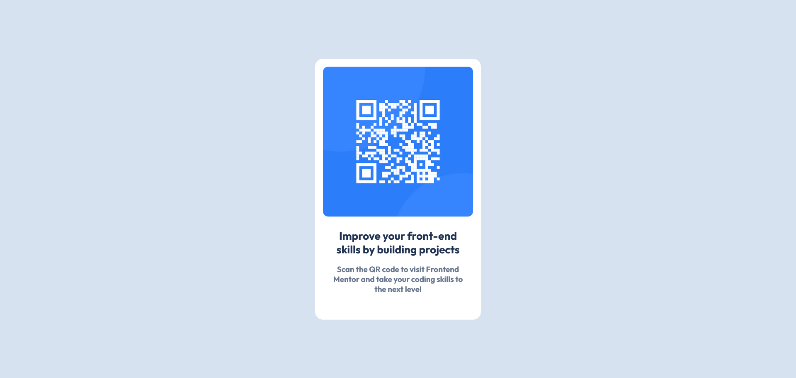

# Frontend Mentor - QR code component solution

This is a solution to the [QR code component challenge on Frontend Mentor](https://www.frontendmentor.io/challenges/qr-code-component-iux_sIO_H).

### Screenshot

### Links

- Solution URL: [Solution URL here](https://www.frontendmentor.io/solutions/qr-code-component-solution-zR17k8uHzE)
- Live Site URL: [Live site URL here](https://tuhin-jr.github.io/Frontend-Mentor---QR-code-component-solution/)

## My process

### Built with

- Semantic HTML5 markup
- CSS custom properties
- Flexbox

## Author

- Frontend Mentor - [@Tuhin-jr](https://www.frontendmentor.io/profile/Tuhin-jr)
  
